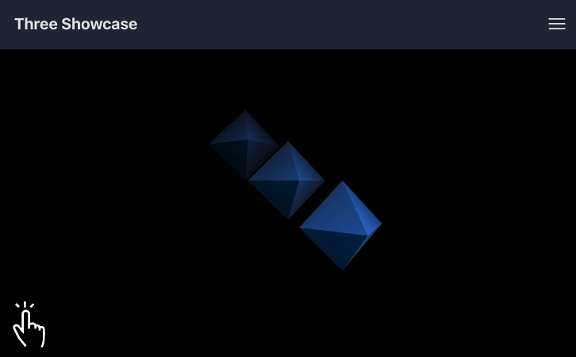

#  Three Showcase

## Project Introduction
Three Showcase is a project built with React and Vite that demonstrates three different scenes using Three.js, including basic geometry, textures, and model displays.

### View the project online: [Three Showcase](https://linus-wu.github.io/three-showcase/)